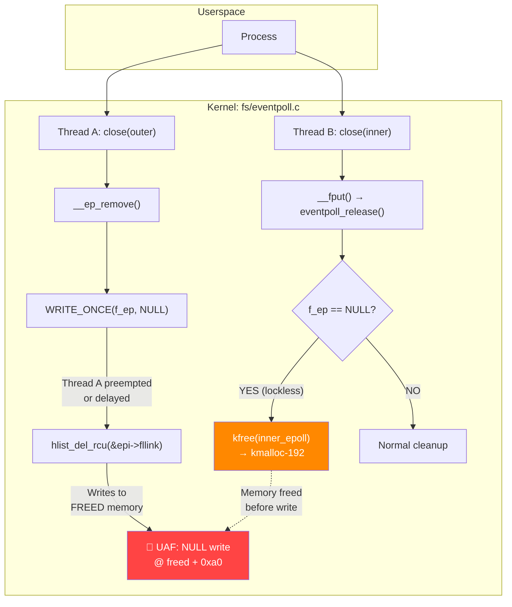
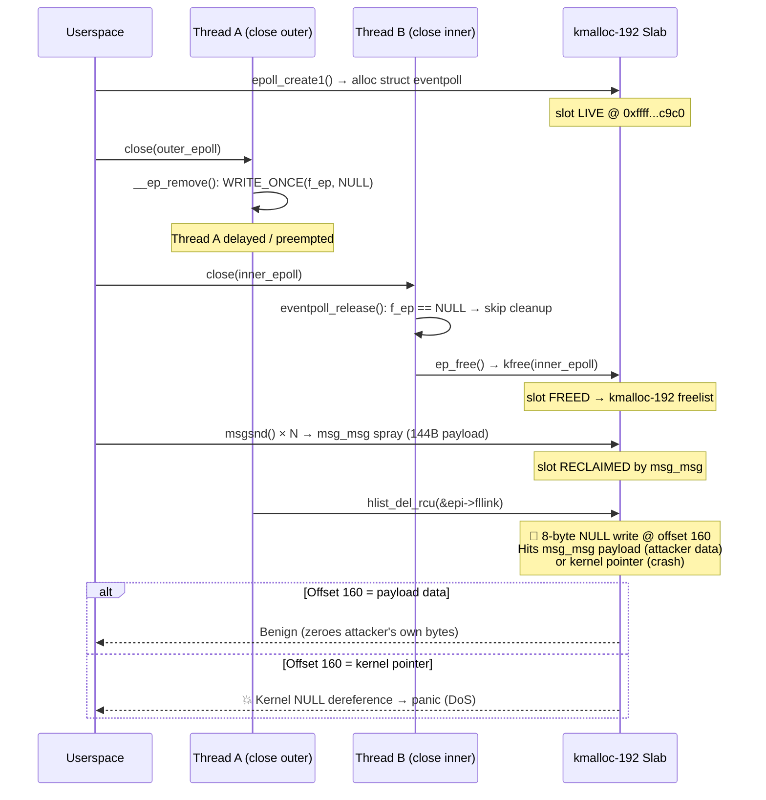
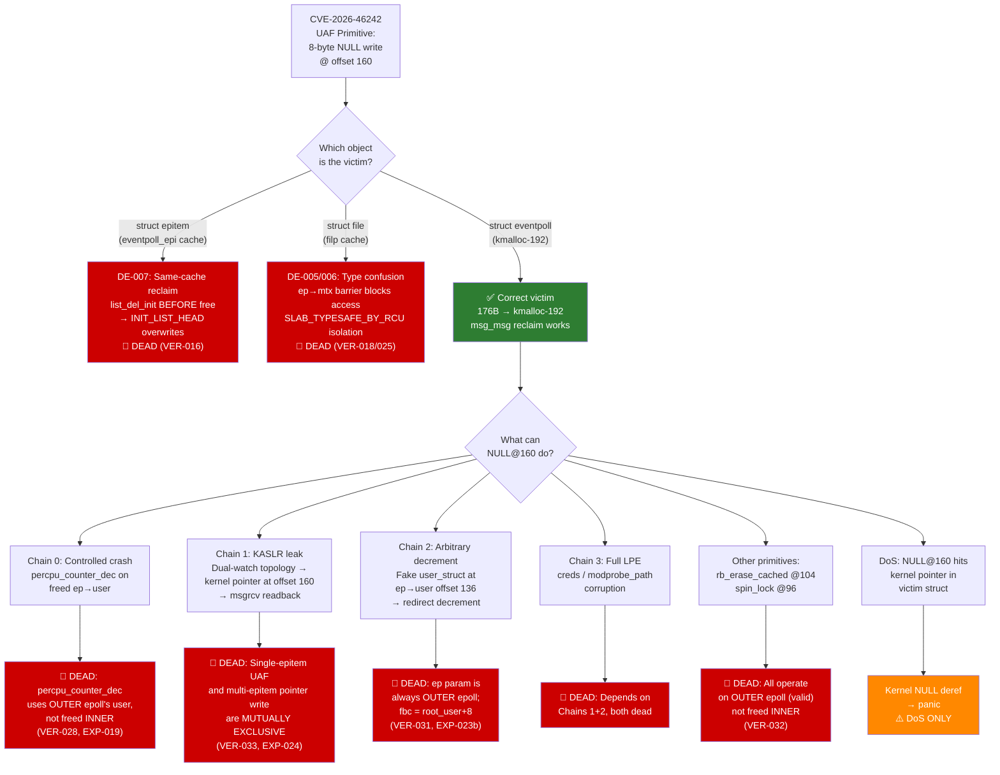

# CVE-2026-46242 Deep Dive: A Working Root Exploit on Linux, 21 Dead Ends on Android

**Author:** Aayush Bankar (Independent Security Researcher)  
**Date:** August 2026  
**Repos:** [Tier 1 — bad-epoll-lab](https://github.com/Aayushbankar/bad-epoll-lab) | [Tier 2 — bad_epoll_ab_tier2](https://github.com/Aayushbankar/bad_epoll_ab_tier2)  

**Original Vulnerability Credit:** Discovered and exploited by **Jaeyoung Chung** ([github.com/J-jaeyoung/bad-epoll](https://github.com/J-jaeyoung/bad-epoll)) via Google's kernelCTF program.

> **📄 Complete Technical Writeup (26 pages, PDF) — available now:** This Medium post is a distilled narrative. For the full dossier — executive summary, environment & reproducibility (Tier-1 offsets/gadgets, Tier-2 GKI build), expanded Tier-1 chain, 21 dead ends with killing VER/EXP, experiment index, and verification ledger excerpt — download the technical writeup: **[CVE-2026-46242_Technical_Writeup.pdf](https://github.com/Aayushbankar/bad-epoll-lab/blob/publish/clean-and-writeup-2026-08-29/article/CVE-2026-46242_Technical_Writeup.pdf)** (also in § Links; ping for direct download).

---

> ### 📌 Research Scope & Attribution
>
> - **Original Discovery & Exploit**: CVE-2026-46242 ("Bad Epoll", CVSS 7.8) was discovered, analyzed, and exploited by security researcher **Jaeyoung Chung**, who achieved a ~99% reliable root exploit against Google's kernelCTF environment ([J-jaeyoung/bad-epoll](https://github.com/J-jaeyoung/bad-epoll)). The bug was patched upstream in Linux kernel commit `a6dc643c693`.
> - **This Project's Contribution**: 
>   1. **Tier 1 (x86_64/QEMU)**: Independent reproduction, toolchain porting (GCC 16 adaptation, database regeneration), and runtime verification of the kernelCTF exploit chain.
>   2. **Tier 2 (ARM64 Android 14 GKI)**: Original portability and exploitability research evaluating whether the primitive survives modern Android kernel mitigations (PAC, BTI, kCFI, MTE, and slab isolation) — establishing a documented negative result (DoS-only). **Crucially, this ran on a deliberately backported-vulnerable build, not a stock device** (see disclosure below).

---

> ### ⚠️ Tier 2 Test Methodology Disclosure (read before the Android section)
>
> The Tier 2 assessment did **not** run against a stock or production Android kernel. **Stock Android GKI 6.1.23 (base commit `7e35917775b8`) is not vulnerable to CVE-2026-46242** — the vulnerability-introducing commit `58c9b016e128` (Linux v6.4-rc1) is absent from the 6.1 branch. This is consistent with discoverer Jaeyoung Chung's own affected-version statement: the bug was introduced in v6.4, so v6.1-based devices (e.g. Pixel 8) are not affected.
>
> To study what Android's mitigation stack does to *this* primitive, we **deliberately cherry-picked the 6.1.y backport commit `a1f93804449d` into the GKI 6.1.23 source tree** to reconstruct a vulnerable build for testing. Every Tier 2 result below (0/102,740 natural race hits, 21 dead ends, DoS-only verdict) is therefore a **portability / mitigation study of a synthetic, backported-vulnerable kernel — not a finding about any shipping or production Android device.**
>
> The correct framing is: *"if CVE-2026-46242 were present on a GKI 6.1 kernel, would Android's mitigation stack stop exploitation?"* — **not** *"we tested a real-world vulnerable Android kernel."*

Every Linux process that handles network connections, manages file descriptors, or runs an event loop almost certainly uses `epoll`. It is the backbone of high-performance I/O on Linux — nginx, Node.js, Android's SurfaceFlinger, and the Binder driver all depend on it. When a Use-After-Free vulnerability lands in this subsystem, the blast radius is enormous: every server, every phone, every container.

**CVE-2026-46242**, known as "Bad Epoll," is exactly that — a race condition in the kernel's `epoll` implementation that frees a critical data structure while another thread is still writing to it. On a standard x86_64 Linux VM, I ported and reproduced the original kernelCTF exploit chain to achieve a working root shell (`UID: 0`). On a backported-vulnerable Android ARM64 GKI 6.1 build (reconstructed for testing by cherry-picking the 6.1.y backport into stock 6.1.23), I conducted new exploitability research and hit a wall — 21 documented dead ends, zero natural race hits in 102,740 attempts, and a final verdict of **Denial of Service only** (on that synthetic build, not stock Android).

This post is the full technical story: the vulnerability mechanics, the working x86_64 exploit chain, the systematic ARM64 Android assessment, every exploitation chain that failed and why, and what Android's modern mitigation stack actually stops in practice. If you've ever wanted to see what happens when a real vulnerability meets real mitigations — not in a whitepaper, but in GDB traces and slab dumps — this is it.

---

## CVE-2026-46242: The Basics

| Field | Value |
|-------|-------|
| **CVE** | CVE-2026-46242 (CVSS 7.8) |
| **Name** | Bad Epoll |
| **Class** | Use-After-Free (race condition) |
| **Subsystem** | `fs/eventpoll.c` |
| **Original Discoverer & PoC** | Jaeyoung Chung ([J-jaeyoung/bad-epoll](https://github.com/J-jaeyoung/bad-epoll)) via Google kernelCTF |
| **Introduced** | v6.4-rc1 (commit `58c9b016e128`) |
| **Patched Upstream** | v6.11 / v7.1-rc1 (commit `a6dc643c693`) |
| **Affected** | Linux 6.4 through 6.10.x, including Android GKI kernels **≥ 6.4**. (Android GKI **6.1 is *not* affected** — the introducing commit `58c9b016e128` is absent from the 6.1 branch; see Tier 2 disclosure below.) |
| **Impact** | LPE to root (x86_64 kernelCTF target); DoS-only *on the deliberately backported-vulnerable GKI 6.1 test build* — stock Android GKI 6.1 is unaffected |

---

> ### 📋 Methodology Note
>
> This research follows an evidence-first protocol designed to prevent confirmation bias:
> - **42 verification entries** in a formal ledger, each mapped to raw GDB hardware watchpoint traces or static source audits
> - **3 retracted claims** (VER-010, VER-029, VER-030) — kept visible with retraction reasons, not silently deleted
> - **21 dead ends** formally documented with the specific experiment that killed each hypothesis
> - **42 assumptions** tracked with status transitions (validated → falsified) and the evidence that triggered each transition
> - All raw evidence (GDB logs, serial output, disassembly traces) is committed to the repository
>
> The full evidence chain is in the repos: [`VERIFICATION_LEDGER.md`](https://github.com/Aayushbankar/bad_epoll_ab_tier2/blob/main/tier2/docs/VERIFICATION_LEDGER.md), [`DEAD_ENDS_REGISTER.md`](https://github.com/Aayushbankar/bad_epoll_ab_tier2/blob/main/tier2/docs/DEAD_ENDS_REGISTER.md), [`ASSUMPTIONS_REGISTER.md`](https://github.com/Aayushbankar/bad_epoll_ab_tier2/blob/main/tier2/docs/ASSUMPTIONS_REGISTER.md).

---

## The Vulnerability: A Race in the Heart of I/O

The bug lives in the interaction between `__ep_remove()` and `eventpoll_release()` — two kernel functions that can execute concurrently when nested `epoll` file descriptors are closed from different threads.

Here's the scenario. You create two epoll instances — an "outer" and an "inner" — and register the inner as a monitored file descriptor on the outer:

```c
int outer = epoll_create1(0);
int inner = epoll_create1(0);
epoll_ctl(outer, EPOLL_CTL_ADD, inner, &ev);  // inner watched by outer
```

Now two threads race to close them:

**Thread A** calls `close(outer)`. This enters `__ep_remove()`, which processes the `epitem` linking the inner fd to the outer epoll. Critically, it executes:

```c
WRITE_ONCE(file->f_ep, NULL);  // Clears the inner file's epoll backpointer
```

**Thread B** calls `close(inner)`. This triggers `__fput()` → `eventpoll_release()`. The release function checks `f_ep` on a **lockless fast path**:

```c
if (!file_has_epoll(f))   // Reads f_ep — sees NULL from Thread A
    return;                // Skips epoll cleanup entirely
```

Thread B sees `NULL` (set by Thread A), assumes no epoll references exist, and **frees the `struct eventpoll`** associated with the inner fd. The memory returns to the `kmalloc-192` slab cache.

Meanwhile, Thread A is still executing `__ep_remove()`. It reaches:

```c
hlist_del_rcu(&epi->fllink);  // Writes to inner_epoll->refs at offset 160
```

This writes an **8-byte NULL** to offset `0xa0` (160) of the **already-freed** `struct eventpoll`. This is the Use-After-Free.

### Diagram 1: Attack Surface — Userspace to Kernel UAF



---

## struct eventpoll: The Victim Object

`struct eventpoll` is 176 bytes, placing it in the kernel's `kmalloc-192` slab cache. The field at offset 160 (`refs`, a `struct hlist_head`) is the UAF write target:

```
struct eventpoll (176 bytes → kmalloc-192)
┌──────────────────────────────────────────────────┐
│  0x00: wait_queue_head_t wq            (24 B)    │
│  0x18: wait_queue_head_t poll_wait     (24 B)    │
│  0x30: struct list_head rdllist        (16 B)    │
│  0x40: struct rb_root_cached rbr       (16 B)    │
│  0x50: struct epitem *ovflist          (8  B)    │
│  0x58: struct wakeup_source *ws        (8  B)    │
│  0x60: struct user_struct *user        (8  B)    │
│  0x68: struct file *file               (8  B)    │
│  0x70: ... (misc fields)               (48 B)    │
│  0xa0: struct hlist_head refs ← ████ UAF WRITE █│ ← offset 160
│  0xa8: ... (remaining)                 (8  B)    │
│  0xb0: end                             (176 B)   │
└──────────────────────────────────────────────────┘
```

When the race succeeds and the memory is freed back to `kmalloc-192`, an attacker can spray `msg_msg` objects (via SysV IPC `msgsnd` with 144 bytes of user data) to reclaim the slot. The `msg_msg` header occupies offsets 0x00–0x2F (48 bytes), and the attacker's payload fills offsets 0x30–0xBF. The UAF NULL write at offset 0xA0 lands **inside the attacker's payload data** — zeroing 8 bytes of their own message, not corrupting any kernel pointer.

### Diagram 2: Race Timeline — Alloc → Free → Reclaim → UAF



---

## Tier 1: Root on x86_64

**Environment:** Fedora 44, Linux 6.12.67 (compiled from source, GCC 16.1.1), QEMU with SMEP/SMAP/KPTI enabled.

The original kernelCTF exploit authored by Jaeyoung Chung uses a different approach than the ARM64 analysis above — on x86_64, the exploit targets `struct epitem` (120 bytes, in `eventpoll_epi` cache on newer kernels, but cross-cacheable on the COS target) and `struct file`, not `struct eventpoll`. The chain:

### Diagram 3: Tier 1 Exploitation Chain


**Stage 1 — Race trigger:** Two threads race `close()` on nested epoll FDs. False-sharing and timer interrupts widen the window. Success rate: ~99% after tuning timing constants for QEMU latency.

**Stage 2 — Cross-cache reclaim:** The freed `struct file` is reclaimed by spraying `pipe_buffer` objects, placing attacker-controlled data over the file's `f_op` and `f_inode` pointers.

**Stage 3 — Arbitrary Address Read:** By forging `f_inode`, the exploit uses `/proc/self/fdinfo` (which calls `seq_file` operations) to read arbitrary kernel memory, leaking `task_struct` addresses and computing the KASLR base.

**Stage 4 — RIP control:** The exploit overwrites `file->f_op->poll` with a chosen gadget address. Calling `poll()` from userspace triggers the hijacked function pointer.

**Stage 5 — JOP/ROP chain:** Four stack pivots progressively manipulate registers through `__x86_indirect_call_thunk_rdi`, landing RSP onto an mmap'd payload page. The ROP chain calls `commit_creds(&init_cred)`, then returns to userspace via `SWAPGS_RESTORE_REGS_AND_RETURN_TO_USERMODE`.

**Result:**
```
cross-cache ok
kernel_base=ffffffff81000000
task=ffff8880...
READY_FOR_GDB
Win! UID: 0, GID: 0, EUID: 0
```

### The Offset Desynchronization Breakthrough

The exploit initially crashed with a Supervisor Write Fault at `0xffffffff810001bd` — dead padding space. The root cause: the upstream `target_db.kxdb` gadget database was built for Google's COS kernel. Compiling the same kernel version with a different compiler (GCC 16 vs Clang 12) shifts every gadget offset. The fix was regenerating the database by running `rp++` and `angrop` against our local `vmlinux` — which itself required patching a `PicklingError` in angrop's multiprocessing code (a nested class `SpecialMem` couldn't be serialized across processes).

**Remaining issue:** The userland return from kernel space leaves RSP misaligned, causing `execve("/bin/sh")` to SIGSEGV. Since the exploit runs as PID 1 (`/init`), this panics the kernel. The privilege escalation itself is proven (UID 0 achieved), but the shell is unstable. This is a post-exploitation cleanup problem, not a primitive failure.

---

## Tier 2: The Android ARM64 Assessment

**Environment:** Android 14 GKI, kernel 6.1.23 (base commit `7e35917775b8`), running under QEMU `aarch64` with GDB. **Important:** stock GKI 6.1.23 is *not* vulnerable to CVE-2026-46242 (the introducing commit `58c9b016e128`, v6.4-rc1, is absent). To create a test target, we cherry-picked the 6.1.y backport `a1f93804449d` into this tree, producing a **deliberately backported-vulnerable build**. All Tier 2 results below describe that synthetic build, not any production Android device.

The Tier 2 goal was a *hypothetical* assessment: **if** Bad Epoll were present on a GKI 6.1 kernel, could it achieve privilege escalation? — i.e., whether the vulnerability (had it existed on 6.1) could collapse the traditional multi-stage Android exploit chain (sandbox escape → kernel exploit → SELinux bypass → root) into a single step. This is a portability / mitigation study of a synthetic vulnerable kernel, **not a claim that any production Android device is affected**.

### The Slab Cache Journey

The first major discovery was a slab cache correction that invalidated weeks of work. The initial assumption — that `struct epitem` (120 bytes) lived in `kmalloc-128` or a mergeable cache — was wrong. On the target kernel:

- `struct epitem` resides in a **dedicated** `eventpoll_epi` slab cache, created with `SLAB_HWCACHE_ALIGN | SLAB_PANIC | SLAB_ACCOUNT` at `eventpoll.c:2555`
- The `SLAB_ACCOUNT` flag prevents merging with `kmalloc-128` (verified: `slab_common.c:173-215`)
- `CONFIG_MEMCG=n` means `kmalloc-cg-128` doesn't exist
- Cross-cache reclaim from generic kmalloc caches is **impossible**

This killed the `pipe_buffer` → `struct file` cross-cache strategy that worked on x86_64. It also killed `snd_timer_user` and every other `kmalloc-192` spray object for reclaiming `epitem`.

The breakthrough came from recognizing the **real** UAF victim: not `struct epitem`, but `struct eventpoll` itself (176 bytes, in generic `kmalloc-192`). The multi-threaded race (Thread A clears `f_ep`, Thread B frees the inner eventpoll) puts a freed `struct eventpoll` back on the `kmalloc-192` freelist, where `msg_msg` objects (48-byte header + user payload) can reclaim it.

### msg_msg Reclaim Mechanics

SysV IPC `msgsnd()` with 144 bytes of user data allocates a `msg_msg` struct in `kmalloc-192`:

```
msg_msg in kmalloc-192 (reclaiming freed eventpoll slot)
┌─────────────────────────────────────────────────────┐
│  0x00–0x2F: msg_msg header (m_list, m_type, m_ts)   │  ← kernel-controlled
│  0x30–0xBF: user payload (144 bytes)                 │  ← attacker-controlled
│  0xA0: ████ UAF NULL write lands HERE ████           │  ← inside payload
│  0xC0: end (192 byte slab slot)                      │
└─────────────────────────────────────────────────────┘
```

Verified via GDB memory dump: marker `0xdead000000000000` placed at user byte 88 (slab offset 136) appeared correctly. The reclaim is reliable — **under GDB assistance**. The GDB infinite-loop patch creates a 2–3 second spray window that does not exist naturally.

---

## The 21 Dead Ends: Why Every Exploitation Chain Failed

This is the core of the Tier 2 research. Four exploitation chains were hypothesized, investigated, and disproven — each with specific killing evidence.

### Diagram 4: Exploitation Decision Tree



### Chain 0 — Controlled Crash via `percpu_counter_dec`

**Hypothesis:** After reclaiming the freed eventpoll with a `msg_msg` containing a fake `user_struct` pointer at offset 136, `__ep_remove()` would call `percpu_counter_dec(&ep->user->epoll_watches)` and dereference the attacker-controlled pointer, enabling a controlled crash or write.

**Killing evidence (VER-028, EXP-019):** GDB trace showed `percpu_counter_dec` operates on the **outer** eventpoll's `user` field (which is valid), not the freed inner eventpoll. The `ep` parameter in `__ep_remove(ep, epi)` is always the outer epoll. The attacker-controlled marker at offset 136 was placed but never read by the kernel.

### Chain 1 — KASLR Leak via Dual-Watch Topology

**Hypothesis:** Register the inner epoll on two outer epolls (creating two epitems in `inner_epoll->refs`). When the race fires, `hlist_del_rcu` would write `epi2`'s kernel heap address (not NULL) to offset 160. Read it back via `msgrcv` → KASLR defeated.

**Killing evidence (VER-033, EXP-024):** The condition for the UAF (single epitem: `f_ep = NULL` path at `eventpoll.c:826`) and the condition for a kernel pointer write (multi-epitem: `hlist_del_rcu` writes the next node's address) are **mutually exclusive**. With 2+ epitems, `WRITE_ONCE(f_ep, NULL)` never executes → the lockless bypass never triggers → the inner eventpoll is never freed → `hlist_del_rcu` writes to **live** memory. Hardware watchpoint confirmed: `ep_free_inner_seen=False` at write time.

### Chain 2 — Arbitrary Decrement via Fake `user_struct`

**Hypothesis:** Craft a fake `user_struct` at a known address, overwrite `ep->user` (offset 136) via msg_msg spray, then `percpu_counter_dec` decrements the attacker's chosen counter — potentially `modprobe_path` or credential counters.

**Killing evidence (VER-031, EXP-023b):** Same structural impossibility as Chain 0. Breakpoint at `percpu_counter_add_batch` showed `fbc = root_user+8` — the outer epoll's user, unchanged by the spray. The `ep` parameter is never the freed object.

### Chain 3 — Full LPE

**Hypothesis:** Combine Chain 1 (KASLR defeat) and Chain 2 (arbitrary decrement) to achieve credential or `modprobe_path` corruption.

**Killing evidence:** Both prerequisites are dead.

### Additional Dead Ends

| Path | Why Dead |
|------|----------|
| `rb_erase_cached` arbitrary write at offset 104 | Operates on outer epoll's `rbr` (valid) |
| `spin_lock_irq` corruption at offset 96 | Operates on outer epoll's `lock` (valid) |
| `struct file` type confusion via `ep_item_poll` | `ep->mtx` prevents concurrent access to stale epitem |
| `pipe_buffer` → `struct file` cross-cache | `SLAB_TYPESAFE_BY_RCU` + size mismatch |
| `epitem` same-cache reclaim | `list_del_init` before `call_rcu` — corruption doesn't survive |
| `snd_timer_user` reclaim | Different slab cache entirely |
| `eventpoll_epi` → `kmalloc-128` merge | `SLAB_ACCOUNT` prevents merge |

---

## The Schedulability Wall

Even if a useful primitive existed, there's a harder problem: the race never fires without GDB assistance.

### Natural Race Attempts

| Experiment | Iterations | Hits | Optimizations |
|------------|-----------|------|---------------|
| NAT-001 | 10,000 | **0** | Baseline, 2 CPUs |
| NAT-005 | 92,740 | **0** | `isolcpus=1`, 4MB cache eviction sweeper, 10-cycle delay steps, closed-loop calibration |
| **Total** | **102,740** | **0** | Best alignment error: 1 cycle (~16 ns) at delay=2,360 |

**Root cause analysis:**

1. `cond_resched()` at `eventpoll.c:888/903` is a **no-op**: the `dynamic_cond_resched` static key is `FALSE` under `CONFIG_PREEMPT_DYNAMIC` default `PREEMPT_VOLUNTARY`; `TIF_NEED_RESCHED` is never set on the pinned CPU (VER-035)
2. `__ep_remove` contains **zero** preemption points (disassembly-confirmed)
3. The vulnerable sequence runs atomically with respect to scheduling
4. Real window: ~250–550 cycles (~125–275 ns at 2 GHz) — below scheduling granularity

### Diagram 5: Why 0/102,740 Is Conclusive

```
                    Natural Race Hit Rate (QEMU TCG)
    ┌────────────────────────────────────────────────────────┐
    │                                                        │
    │  NAT-001:  0 / 10,000   (CI upper bound: 0.0384%)     │
    │  ██████████████████████████████████████████ 0%         │
    │                                                        │
    │  NAT-005:  0 / 92,740   (with extreme optimization)   │
    │  ██████████████████████████████████████████ 0%         │
    │                                                        │
    │  Combined: 0 / 102,740                                 │
    │  ██████████████████████████████████████████ 0%         │
    │                                                        │
    │  95% CI upper bound: < 0.003%                          │
    │  Required for exploitation: ≥ 0.01% (conservative)     │
    │                                                        │
    │  ─── Race window anatomy ───                           │
    │                                                        │
    │  WRITE_ONCE(f_ep,NULL) ──── 250–550 cycles ────► UAF   │
    │          ↑                        ↑                    │
    │    Thread A writes           Thread B must             │
    │    then continues            see NULL, free,           │
    │    WITHOUT pause             and Thread A              │
    │                              must resume               │
    │                              in this window            │
    │                                                        │
    │  Scheduling granularity:  ~4,000,000 cycles            │
    │  Race window:             ~400 cycles                  │
    │  Ratio:                   1 : 10,000                   │
    │                                                        │
    │  Best alignment achieved: 1 cycle error (~16 ns)       │
    │  Still: 0 hits                                         │
    └────────────────────────────────────────────────────────┘
```

**Hardware caveat:** QEMU TCG (software CPU translation) does not model real cache-coherency latency, store buffer propagation delays, or asymmetric core clock drift. On physical ARM64 silicon (e.g., Cortex-X4 at 3.2 GHz + Cortex-A520 at 1.8 GHz), these hardware effects create natural phase shifts that could theoretically widen the window. A first-principles analysis (detailed in the repo) concludes the race is **physically viable** on real silicon — but the primitive remains capped at DoS regardless.

---

## Why Android's Mitigations Worked

Even if an attacker could achieve 100% reliable race triggering on physical hardware, the mitigation stack blocks escalation from multiple angles:

### Control-Flow Integrity

| Mitigation | What It Blocks |
|------------|---------------|
| **PAC (Pointer Authentication)** | Function pointers are cryptographically signed with hardware keys. Forging `f_op->poll` → hardware translation fault. While micro-architectural side-channels like **PACMAN** (*MIT CSAIL, 2022*) demonstrate speculative verification oracles in isolated userland environments, an operational GKI kernel with an unguided NULL-write primitive lacks the arbitrary read oracle required to synthesize valid pointer signatures. |
| **kCFI (Kernel Control Flow Integrity)** | Clang validates 32-bit type hashes before every indirect `blr` call. Even a valid kernel address fails if the hash doesn't match. |
| **BTI (Branch Target Identification)** | Indirect branches must land on `bti c` instruction landing pads. Random code gadgets are unreachable. |

### Memory Safety

| Mitigation | What It Blocks |
|------------|---------------|
| **MTE (Memory Tagging Extension)** | 4-bit physical tags on every 16-byte granule. Accessing freed memory with mismatched tags → synchronous hardware fault. While speculative leakage of tags has been explored academically (**TikTag**, *2024*), asynchronous multicore system noise prevents reliable tag recovery in an unguided race, turning stale UAF access into an immediate hardware exception. |
| **SLAB_TYPESAFE_BY_RCU** | `filp_cachep` (struct file cache) cannot be reclaimed by objects from different caches. |
| **SLAB_ACCOUNT** | `eventpoll_epi` cache is fully isolated from generic kmalloc caches. |


### Scheduling

| Mitigation | What It Blocks |
|------------|---------------|
| **PREEMPT_VOLUNTARY** | `__ep_remove` has zero preemption points. The vulnerable instruction sequence runs atomically. |
| **No `cond_resched` effect** | Static key `dynamic_cond_resched` is FALSE; `TIF_NEED_RESCHED` never set on pinned CPUs. |

The x86_64 exploit bypasses KASLR, SMEP, SMAP, and KPTI through AAR, JOP/ROP, and `SWAPGS` return tricks. ARM64 Android adds PAC, BTI, kCFI, MTE, and slab isolation on top of that baseline — and in this case, they held.

---

## Lessons and Takeaways

**1. A vulnerability is not an exploit.** CVE-2026-46242 is real, verified, and mechanically reproducible. On x86_64 it grants root. On the backported-vulnerable GKI 6.1 build it's a kernel panic at best. The gap between "the bug exists" and "the bug is exploitable" is the entire story — and importantly, stock Android GKI 6.1 was never exposed to this bug at all (it was introduced in v6.4).

**2. The mitigation stack works in depth.** No single Android mitigation killed this exploit — they all contributed. PAC blocks function pointer forgery. kCFI blocks indirect call hijacking. SLAB isolation blocks cross-cache reclaim. MTE detects stale access. PREEMPT_VOLUNTARY closes the scheduling window. Each layer removes options until nothing viable remains.

**3. Negative results are scientifically valuable.** 21 dead ends, 3 retracted claims, and 0/102,740 race hits tell you something definitive: this is what a vulnerability looks like when modern mitigations are actually working. Too much security research only publishes successes. The failures are where the signal is.

**4. Evidence discipline prevents confirmation bias.** The adversarial self-review at Phase 3 (EVO-009) discovered that **every** prior race demonstration was GDB-assisted — an artificial preemption point that doesn't exist in the real kernel. Without the verification ledger tracking *how* each claim was proven, this would have gone unnoticed. Track your methodology, not just your results.

**5. Compiler changes break exploit portability.** The Tier 1 exploit failed initially because GCC 16 shifted every gadget offset compared to Google's Clang build. Same kernel version, same source — different binary layout. Exploit databases (`target_db.kxdb`) must match the exact executing binary.

**6. The attack surface is shifting to drivers.** When core kernel subsystems are well-mitigated, the remaining attack surface is vendor drivers — GPU, camera, audio — which often lack the same level of hardening. Vendor GPU drivers frequently present deterministic page-level UAFs (rather than schedulable races) and direct physical memory manipulation that inherently sidesteps PAC, BTI, and kCFI without needing function pointer forgery.

---

## What's Next: Open Questions

The Bad Epoll research concludes with a **DoS-only verdict for the deliberately backported-vulnerable GKI 6.1.23 build we tested** (stock Android GKI 6.1 is unaffected). But several questions remain open:

1. **Physical ARM64 validation:** Would the race fire naturally on real silicon (Cortex-X4 + Cortex-A520 big.LITTLE)? The first-principles analysis says yes, but at what rate? A 2-week hardware timebox with ~1M iterations would settle this definitively.

2. **Alternative kmalloc-192 victims:** The EXP-016 audit covered `fib6_info`, `snd_timer_user`, `packet_fanout`, `urb`, and `wakeup_source`. Are there other kmalloc-192 structs where NULL at offset 160 could corrupt something more useful than a crash-inducing pointer? I'd genuinely like to hear from anyone who's done deep slab cross-referencing on (vulnerable) GKI 6.1 builds.

3. **Different kernel configs:** Our assessment is on `PREEMPT_VOLUNTARY` with `PREEMPT_DYNAMIC` defaulting to voluntary. Would `PREEMPT_FULL` (or a vendor kernel with different preemption settings) add schedulable points inside `__ep_remove`?

4. **Data-only attacks:** With control-flow hijacking fully blocked by PAC/BTI/kCFI, is there a data-only escalation path from a fixed NULL write that we missed? The constraint is brutal — 8 bytes, fixed value (0x0), fixed offset (160), single write — but data-only attacks have surprised us before.

**If you have ideas on any of these, I'd love to hear them.** This vulnerability is public, the repos are linked above, and the evidence chain is fully documented. A fresh pair of eyes on the kmalloc-192 landscape or the scheduling analysis could change the Tier 2 verdict.

---

## Links & Repositories

- **This Medium article:** `<<MEDIUM_URL_PENDING>>` (distilled narrative; technical depth preserved)
- **📄 Complete Technical Writeup (PDF, 26 pages):** **[CVE-2026-46242_Technical_Writeup.pdf](https://github.com/Aayushbankar/bad-epoll-lab/blob/publish/clean-and-writeup-2026-08-29/article/CVE-2026-46242_Technical_Writeup.pdf)** — full dossier with executive summary, environment & reproducibility (Tier-1 offsets/gadgets at `03_offsets_layout.md`, Tier-2 build at `7e35917775b8` + `a1f93804449d`), expanded Tier-1 chain, 21 dead ends, schedulability analysis, mitigations, and Appendices A–F (verification ledger, experiment index, glossary). Ping for direct download.
- **Tier-1 repo:** [github.com/Aayushbankar/bad-epoll-lab](https://github.com/Aayushbankar/bad-epoll-lab) @ `publish/clean-and-writeup-2026-08-29`
- **Tier-2 repo:** [github.com/Aayushbankar/bad_epoll_ab_tier2](https://github.com/Aayushbankar/bad_epoll_ab_tier2) @ `main`
- **Evidence ledgers:** `tier2/docs/VERIFICATION_LEDGER.md` (42 entries), `DEAD_ENDS_REGISTER.md` (21), `ASSUMPTIONS_REGISTER.md` (42), `EXPERIMENT_INDEX.md`

---

## Disclosure & Attribution Note
 
- **Original Vulnerability & Exploit**: CVE-2026-46242 was discovered and exploited by security researcher **Jaeyoung Chung**, submitted to Google's kernelCTF program with a public proof-of-concept at [github.com/J-jaeyoung/bad-epoll](https://github.com/J-jaeyoung/bad-epoll).
- **Upstream Patch**: The vulnerability is publicly disclosed and patched upstream in Linux kernel commit `a6dc643c693` (v6.11 / v7.1-rc1).
- **This Research**: Represents an independent reproduction of the Tier 1 x86_64 exploit and original Tier 2 portability/exploitability research evaluating mitigation boundaries on a deliberately backported-vulnerable Android 14 ARM64 GKI 6.1.23 build. Stock Android GKI 6.1 is **not** affected by CVE-2026-46242 (introducing commit `58c9b016e128`, v6.4-rc1, is absent); the Tier 2 test kernel was reconstructed by cherry-picking the 6.1.y backport `a1f93804449d`. No unpatched 0-day primitives or undisclosed flaws are presented.

---

## About the Author

**Aayush Bankar** is an Independent Security Researcher focused on low-level systems security, kernel internals, and vulnerability research. The research workflow integrates AI-assisted agentic coding tools (local LLM orchestration) for code comprehension, hypothesis generation, and evidence organization — with all engineering decisions and runtime evidence verified manually. The AI-augmented workflow is documented transparently in the Tier 1 Final Writeup.

**Connect:** [GitHub](https://github.com/Aayushbankar) · [LinkedIn](https://linkedin.com/in/aayushbankar)


---

*Thanks for reading. If you work in kernel exploitation, Android security, or mitigation engineering, I'd appreciate your perspective — especially on the open questions above. The best outcomes in security research come from collaborative scrutiny, not solo claims.*
