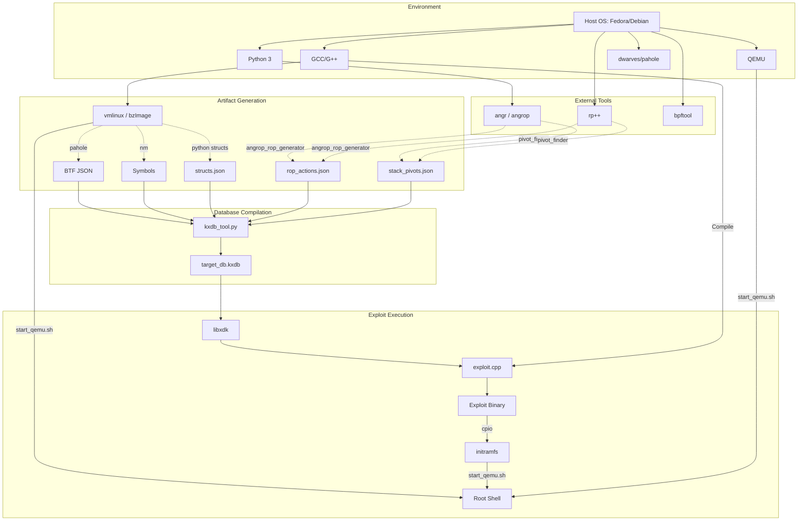

# Phase 1: Repository Audit

## 1. System Requirements & Dependencies

### Operating Systems Supported
- Fedora Linux (Primary Dev Environment, Tested on 44)
- Ubuntu/Debian (Common Linux)

### Required Compilers & Toolchains
- **GCC / G++**: >= 12.0 (Tested on 16.1.1)
- **Make**: Standard GNU Make
- **CMake**: Required for external dependencies (if building rp++ from source)

### Required System Packages
**Fedora:**
```bash
sudo dnf install -y gcc g++ make git python3 python3-pip wget unzip curl bpftool dwarves
```
**Ubuntu/Debian:**
```bash
sudo apt update
sudo apt install -y build-essential git python3 python3-pip wget unzip curl linux-tools-common linux-tools-generic dwarves
```

### Required Python Packages
```bash
pip install --user angr angrop keystone-engine pyelftools capstone unicorn
```

### External Binaries & Tools
- **rp++**: (Version v2.1.5 or compatible) Required by the generator pipeline to extract ROP/JOP gadgets. Must be available in `$PATH`.
- **bpftool**: Extracts BTF data from vmlinux.
- **pahole**: (Part of `dwarves`) Encodes/decodes BTF data.
- **QEMU**: `qemu-system-x86_64` for running the Tier 1 Linux VM.

## 2. Configuration & Environment

### Environment Variables
- `$PATH`: Must include paths to `rp++` and Python local bin directory (`~/.local/bin`).

### Kernel Configuration Requirements
The exploit is highly dependent on specific kernel configurations (`.config`), specifically:
- `CONFIG_EPOLL=y`
- `CONFIG_SLAB_FREELIST_RANDOM` (Bypassed via cross-cache heap layout)
- `CONFIG_SLAB_FREELIST_HARDENED` (Bypassed)
- `CONFIG_PAGE_TABLE_ISOLATION=y` (KPTI, accommodated via `SWAPGS_RESTORE_REGS_AND_RETURN_TO_USERMODE`)
- `CONFIG_RETPOLINE=y` (Required for the `__x86_indirect_call_thunk_rdi` JOP pivot)

### Required VM Settings / QEMU Arguments
The `start_qemu.sh` launch script requires:
```bash
qemu-system-x86_64 \
    -m 2G \
    -smp 2 \
    -kernel ../linux-6.12.67/arch/x86/boot/bzImage \
    -append "console=ttyS0 root=/dev/ram rdinit=/init quiet oops=panic panic=-1 nokaslr" \
    -initrd rootfs_debug/initramfs_exploit_debug.cpio \
    -net user -net nic -device e1000 \
    -nographic \
    -no-reboot
```
*(Note: `nokaslr` is appended strictly for debug stabilization; the exploit bypasses KASLR automatically via `init_task` leakage).*

## 3. Dependency Graph


