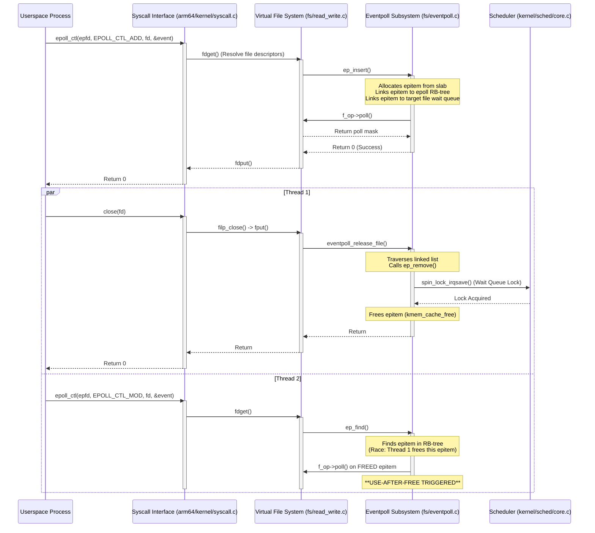

# Kernel Execution Flow (CVE-2026-46242 context)

This document traces the complete execution path from a userspace system call to the internal kernel subsystems and back, specifically focusing on the `epoll` and VFS interactions critical for triggering the vulnerability.

## Execution Path Diagram

