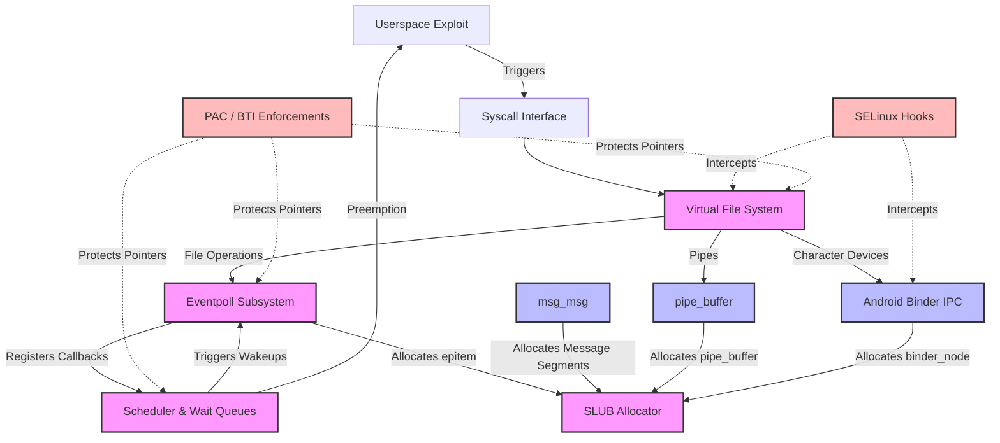

# Subsystem Dependency Map

This document visually maps the complex relationships between the kernel subsystems relevant to Android GKI local privilege escalation.

## Component Interaction Diagram

## Description of Interactions
1. **Epoll -> SLUB -> Pipe/MsgMsg/Binder**: The core UAF occurs in `Epoll`. It is managed by `SLUB`. The exploit relies on using `Pipe`, `MsgMsg`, or `Binder` to spray the `SLUB` allocator and overlap the freed `Epoll` memory.
2. **Epoll -> VFS -> PAC/BTI**: `Epoll` calls into `VFS` via `f_op->poll()`. The `VFS` function pointers are heavily protected by `PAC/BTI`, requiring bypass mechanisms.
3. **Userspace -> Binder -> SELinux**: The userspace process interacts with `Binder`, but the resulting transactions and file descriptors are policed by `SELinux`.
